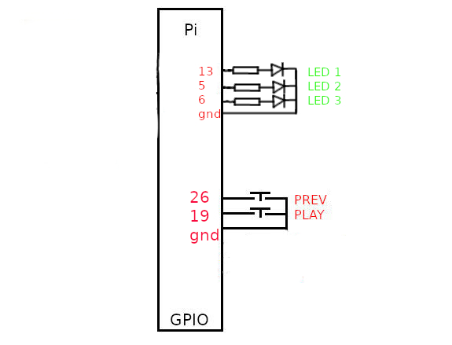

# Pi-2Button-MP3-Player

A simple MP3 Player using a Raspberry Pi and 2 buttons, and 3 LEDs.

All buttons are connected between gpios and gnd (1k resistors in series are usually recommended), LEDs are connected between gpios and gnd, with suitable resistors.

2 button switches, 1st for PLAY/STOP/SHUTDOWN, the 2nd for SHUFFLE/PREVIOUS TRACK/REBOOT

3 LEDs, 1st for Running , 2nd for Playing, 3rd for Shuffled.

# BUTTONS

PLAY = 19 # PLAY / STOP / SHUTDOWN (hold down for 5 seconds)

PREV = 26 # PREVIOUS (whilst playing) / SHUFFLE (whilst stopped) / REBOOT (hold down for 5 seconds)

# LEDS

LED1 = 13 # READY LED / Flashes during startup checking for USB stick

LED2 = 5  # PLAYING LED

LED3 = 6  # SHUFFLED LED / LOADING MP3s(Flashes if no MP3s found)

At power up LED1 will flash for whilst it boots, LED3 will light whilst it loads tracks, LED2 will light when ready to play.

Press 2nd (PREV) button to shuffle tracks whilst not playing. LED3 will light. Press again to unshuffle, LED3 will go off.

Press 1st (PLAY) button to start playing. LED1 will light.

Whilst playing, Press 1st button to STOP playing, press again to play NEXT track. Press 2nd button to play previous track.

Hold down 1st button for 5 seconds to shutdown Pi. Hold down 2nd button for 5 seconds to reboot Pi. 

At boot it will look for mp3 tracks in '/home/USERNAME/Music', and on a USB stick with the format /Artist/Album/Tracks

To install copy 2B_MP3_player.py to /home/USERNAME 

and then 

sudo apt-get install mplayer

sudo pip3 install mutagen --break-system-packages (or use a venv)

to run python3 2B_MP3_player.py

starting options:

# if using BLUETOOTH speaker set use_BT = 1

use_BT = 0

# to set default SHUFFLE set shuffled = 1

shuffled = 0

# to play at startup set Con_Play = 1

Con_Play = 0
